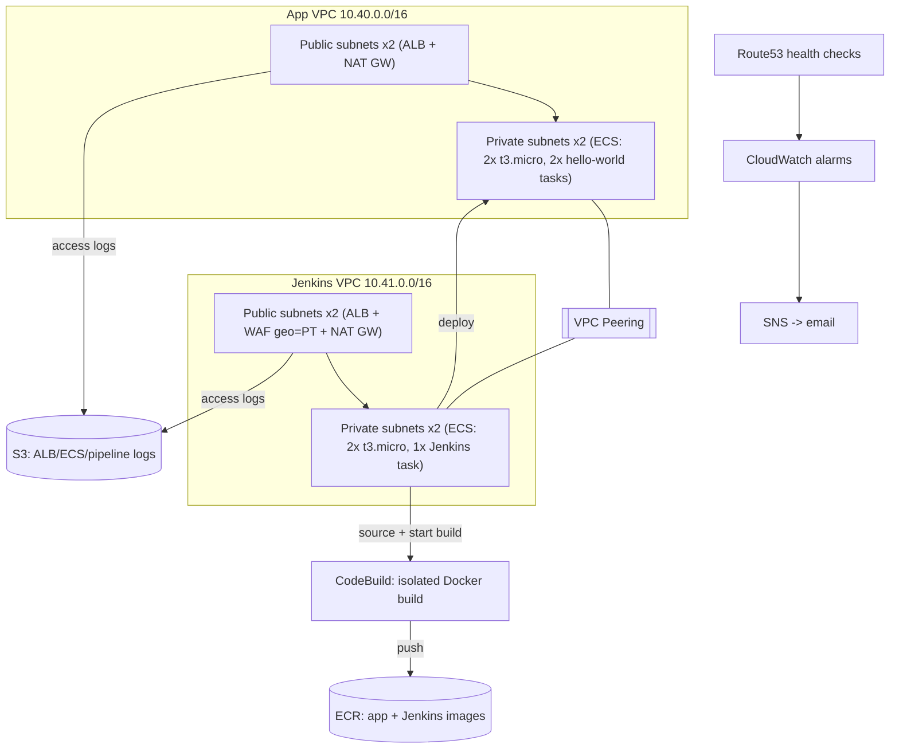

# Broken Cloud Pipeline

A deliberately flawed (in exactly three, documented ways) AWS deployment pipeline for a small
public web app and a Jenkins CI server, built with Terraform, running on ECS-on-EC2 in
`eu-central-1`, with ALBs, Route53 health checks, CloudWatch alarms, SNS notifications, S3
logging, and a manually-triggered Jenkins pipeline that builds/pushes to ECR and deploys to ECS.

This repository is the implementation of the assignment in [task.md](task.md). See
[ai-conversation-log.md](ai-conversation-log.md) for the full AI interaction history.

Repository: [shnartho/aws-ecs-jenkins-pipeline](https://github.com/shnartho/aws-ecs-jenkins-pipeline)

## 1. Live Demo and Reviewer Checks

Reviewers can inspect the deployed user-facing surfaces directly in a browser:

| Surface | URL | Expected result |
|---|---|---|
| Application | [https://app.goldrg.com](https://app.goldrg.com) | Hello-world application loads over HTTPS with HTTP 200 |
| Application health | [https://app.goldrg.com/health](https://app.goldrg.com/health) | Health endpoint returns HTTP 200 |
| Jenkins | [https://jenkins.goldrg.com/login](https://jenkins.goldrg.com/login) | Jenkins login page loads over HTTPS with HTTP 200 from Portugal |

Jenkins is intentionally protected by an AWS WAF geographic allow rule. A reviewer outside
Portugal should expect an HTTP 403 response rather than the login page; that response confirms
the restriction is being enforced. Use the certificate-compatible domain names above rather than
the raw ALB hostnames.

## What to Expect

Use this map to jump directly to the implementation detail or operational evidence you need.

| Section | What you will find |
|---|---|
| [1. Live Demo and Reviewer Checks](#1-live-demo-and-reviewer-checks) | Browser links and expected end-user behavior |
| [2. Project Overview](#2-project-overview) | Workload purpose, account boundaries, and runtime model |
| [3. Architecture](#3-architecture) | End-to-end AWS topology and traffic flow diagram |
| [4. AWS Services Used](#4-aws-services-used) | Service inventory and responsibilities |
| [5. Networking](#5-networking) | VPCs, subnets, routing, peering, ingress, and egress decisions |
| [6. Terraform Structure](#6-terraform-structure) | Bootstrap/workload separation and reusable module boundaries |
| [7. ECS Architecture](#7-ecs-architecture) | ECS-on-EC2 capacity, task placement, persistence, and deployment behavior |
| [8. Jenkins Pipeline](#8-jenkins-pipeline) | CodeBuild-backed image build and ECS release workflow |
| [9. Security Model](#9-security-model) | IAM, network controls, encryption, WAF, and secret-handling boundaries |
| [10. Monitoring / Logging](#10-monitoring--logging) | CloudWatch, SNS, Route53, S3, and log retention model |
| [11. Cost Decisions](#11-cost-decisions) | Cost-aware infrastructure choices and rejected alternatives |
| [12. The Three Deliberate Flaws](#12-the-three-deliberate-flaws) | Exact protected flaws, impacts, and independent fixes |
| [13. Testing](#13-testing) | Static checks, live verification, and local Make workflow |
| [14. Deployment Instructions](#14-deployment-instructions) | Ordered bootstrap and workload deployment procedure |
| [15. Cleanup Instructions](#15-cleanup-instructions) | Safe resource teardown sequence |
| [16. Assumptions / External Prerequisites](#16-assumptions--external-prerequisites) | Required external inputs, quotas, and manual actions |
| [17. Tradeoffs](#17-tradeoffs) | Explicit architectural compromises that are not flaws |
| [18. AI Usage](#18-ai-usage) | Location of the AI-assisted engineering record |

## 2. Project Overview

Two independent, peered VPCs each host one ECS-on-EC2 cluster behind one public Application Load
Balancer:

- **App VPC** (`10.40.0.0/16`): runs 2 copies of a customized `infrastructureascode/hello-world`
  container, reachable by anyone over HTTPS.
- **Jenkins VPC** (`10.41.0.0/16`): runs one versioned custom Jenkins controller, reachable over HTTPS
  only from an allow-listed set of countries (default: Portugal) via AWS WAFv2.

Jenkins uploads a source archive and delegates the privileged Docker build to AWS CodeBuild, then
deploys the immutable ECR image to ECS. The controller runs non-root with no host Docker socket.

## 3. Architecture



Both ALBs sit in public subnets; all compute (ECS EC2 instances and tasks) stays in private
subnets. There is no SSH/bastion anywhere - instance access is via AWS SSM Session Manager only,
consistent with the "HTTPS-only inbound" requirement.

## 4. AWS Services Used

EC2, ECS (EC2 launch type via a capacity provider, not Fargate), IAM, Route53 (health checks),
S3 (logging), CloudWatch (logs, alarms), ECR, SNS, plus VPC/ALB/WAFv2 as required supporting
networking/edge services.

## 5. Networking

| Concern | Decision |
|---|---|
| VPC module | `terraform-aws-modules/vpc/aws` for both VPCs, per requirement |
| Subnets | 2 public + 2 private per VPC (4 total per VPC), one AZ pair (`eu-central-1a/b`) |
| NAT | **1 NAT Gateway per VPC** (single-AZ, not one-per-AZ) - see [Tradeoffs](#17-tradeoffs) |
| VPC endpoints | Free **S3 gateway endpoint** in each VPC, to keep S3 traffic off the NAT Gateway. Interface endpoints (ECR/CloudWatch/SSM) were evaluated and rejected as over-engineering for this exercise's traffic volume - see [Cost Decisions](#11-cost-decisions) |
| VPC Peering | One peering connection + routes between `10.40.0.0/16` and `10.41.0.0/16` private route tables, satisfying the explicit requirement (Jenkins actually deploys via public AWS APIs, not a direct network path - the peering has no other functional dependency in this design) |
| NACLs | Custom NACL on **public** subnets only: allow 443 inbound + ephemeral (1024-65535) return traffic, allow all outbound. Private subnets keep module defaults (allow all intra-VPC) since security groups are the real reachability boundary there |
| Security groups | ALB SGs: 443 inbound from `allowed_cidrs` (all outbound). ECS instance SGs: dynamic port range (32768-65535) from the ALB SG only (all outbound) |
| Internet access | HTTPS (443) only, anywhere, in or out of the ALBs |

## 6. Terraform Structure

```
terraform/
├── bootstrap/          # SEPARATE layer: state backend (S3+DynamoDB) + deploy IAM role.
│                       # Applied once, by hand, with elevated credentials; local state (see below).
│                       # Never touched by workload applies; not reused/imported by envs/*.
├── modules/
│   ├── ecs-service/   # cluster, capacity provider, ASG, task def, service - reused by app + Jenkins
│   └── public-alb/    # ALB, listener, target group, SG, optional WAF association - reused by both
└── envs/eu-central-1/ # workload layer: everything from Requirement Audit below
    ├── backend.tf, providers.tf, variables.tf, locals.tf, data.tf
    ├── vpc-app.tf, vpc-jenkins.tf, vpc-endpoints.tf, peering.tf
    ├── s3-logging.tf, ecr.tf, codebuild.tf, waf.tf, route53.tf, monitoring.tf
    ├── app.tf, jenkins.tf          # module instantiations - this is where reuse is exercised
    └── outputs.tf
```

**Bootstrap vs. workload layers**: `terraform/bootstrap` and `terraform/envs/eu-central-1` are two
independent Terraform root modules with no dependency of the workload layer on the bootstrap
layer's *state* (only on its **outputs**, copied in by hand). This mirrors how a real organization
would split this across two repositories: a rarely-changed, tightly-reviewed "platform foundation"
repo (state backend, deploy roles, account guardrails) versus frequently-changed "workload" repos
that only ever *assume* a role and *reference* a backend - never create either for themselves. A
workload stack that could modify its own deploy role would be a privilege-escalation hole, so
`envs/eu-central-1` intentionally has no `aws_iam_role`/`aws_iam_policy` resources of its own beyond
the narrow, prefix-scoped runtime roles inside `modules/ecs-service` (instance/task/execution
roles - those are fine, since they only grant the running containers permissions, not the deployer).
See `terraform/bootstrap/providers.tf` for why bootstrap uses local state, and its
`terraform.tfvars.example` / this repo's [Deployment Instructions](#14-deployment-instructions) for
how to run it.

**File-splitting standard**: one file per resource *concern* within the single `envs/eu-central-1`
environment (networking, logging, registry, edge/WAF, DNS/health, observability, per-service
wiring). Reusable multi-resource patterns are factored into `modules/`, not duplicated per service.
Every resource has a one-line comment explaining its purpose; `variables.tf` uses object types with
`optional()` defaults for `var.tags`, per the requirement; the AWS provider applies these via
`default_tags` in `providers.tf`.

Terraform is verified with `terraform fmt -recursive -check` and `terraform validate` (both pass -
see [Testing](#13-testing)), plus `tflint` and `checkov` via pre-commit.

## 7. ECS Architecture

Both clusters use the same reusable `modules/ecs-service`:

- ECS-optimized AMI resolved dynamically via SSM Parameter Store (never a pinned/stale AMI ID).
- A fixed-size (min=max=desired) Auto Scaling Group of `t3.micro` instances in private subnets,
  registered to the cluster through an `aws_ecs_capacity_provider` (managed scaling enabled,
  managed termination protection enabled).
- Task definitions use `network_mode = "bridge"` with dynamic host-port mapping (`hostPort = 0`),
  so the ALB target group (`target_type = "instance"`) works without `awsvpc` ENI overhead.
- Differences between the app and Jenkins are expressed through module variables. The app service
  follows the latest active task-definition revision, so Terraform does not roll back pipeline releases.

| | App | Jenkins |
|---|---|---|
| Containers | 2x customized `hello-world` | 1x versioned custom Jenkins |
| Task CPU/Mem | **1024**/512 (see [Flaw #1](#12-the-three-deliberate-flaws)) | 512/700 |
| Task role extras | none | CodeBuild invocation, ECS deploy, S3/log/SNS access |
| Docker socket mount | no | no |

## 8. Jenkins Pipeline

`jenkins/Jenkinsfile` - manually triggered only (no SCM polling/webhooks):

1. **Checkout** source.
2. **Build and push** - uploads source to S3 and starts the dedicated CodeBuild project.
  CodeBuild alone has privileged Docker mode and app-repository push access.
4. **Deploy to ECS** - registers a new task-definition revision with the new (uniquely-tagged)
   image and updates the app service to use it.
5. **Verify** - runs `scripts/verify_health.sh` against the app ALB.
6. **Post**: `always` archives build logs to S3 (**Flaw #2** - see below); `success`/`failure`
   both publish to SNS, so every outcome is emailed.

## 9. Security Model

- **Inbound**: 443 only, everywhere (ALB SGs and public-subnet NACLs). No SSH/bastion anywhere;
  instance access is via SSM Session Manager.
- **Jenkins geo-restriction**: enforced by AWS WAFv2. A higher-priority rule allows only AWS's
  published Route53 health-checker CIDRs to request `/login`; all other traffic remains geo-filtered.
- **IAM**: Jenkins can start one CodeBuild project but cannot push ECR images. CodeBuild can read
  only its source prefix and push only the app repository. Jenkins deploy permissions target the
  app service; unavoidable unscoped ECS actions are documented inline.
- **Secrets**: none are committed. Transcrypt is configured per the requirement, but there is
  nothing sensitive to encrypt because credentials are never stored in the repo - IAM roles are
  used everywhere instead (see [Tradeoffs](#17-tradeoffs)).
- **S3**: the logging bucket is private (public access block), SSE-S3 encrypted, versioned with
  lifecycle expiration, and its bucket policy grants write access only to the AWS-managed ELB
  log-delivery principal on the `alb-logs/*` prefix.
- **ECR**: image scanning on push, immutable tags, lifecycle policy limiting retained images.
- **Deployer identity**: `terraform apply` for the workload layer is not run by any role this
  stack creates (a Terraform config cannot grant itself permission before it exists). The separate
  [terraform/bootstrap](terraform/bootstrap) module creates a scoped IAM role (permissions in
  `deploy_role.tf`'s `data.aws_iam_policy_document.deploy_permissions` - not
  `AdministratorAccess`, restricted to exactly the services this stack touches, plus IAM actions
  restricted to the `app-*`/`jenkins-*` resource prefixes it creates) with a separate trust policy
  (`data.aws_iam_policy_document.deploy_trust`) naming the specific principals allowed to assume
  it. Permissions and trust policies are different documents and are not interchangeable - see
  [Terraform Structure](#6-terraform-structure) for why this lives in its own layer entirely.

## 10. Monitoring / Logging

- **CloudWatch**: `HTTPCode_Target_5XX_Count > 0` alarm per ALB, plus an `AWS/Billing`
  `EstimatedCharges` alarm (must run in `us-east-1` - AWS only publishes billing metrics there).
  ECS container logs go to CloudWatch Logs (`awslogs` driver).
- **SNS**: two topics (one per region, since alarm actions must be in the same region as the
  alarm) both subscribed with the same email; each requires manual confirmation after apply.
- **Route53**: one HTTPS health check per ALB, targeting the ALB's own AWS DNS name directly - no
  owned domain is required (see [Assumptions](#16-assumptions--external-prerequisites)).
- **S3 logging**: ALB access logs (`alb-logs/app/`, `alb-logs/jenkins/`) and Jenkins pipeline logs
  (`pipeline-logs/`) all land in one bucket with a 30-day expiration lifecycle rule.

## 11. Cost Decisions

- `t3.micro` x4 (2 per cluster x 2 clusters) - the smallest instance size that satisfies the
  assignment's explicit "t3.micro" requirement; exceeds the literal AWS free-tier hour allowance
  but is the cheapest compliant option.
- **Single NAT Gateway per VPC** (not per-AZ) - roughly halves NAT cost; accepted loss of
  cross-AZ redundancy for private-subnet egress in this non-production exercise.
- **Free S3 gateway VPC endpoints** added in both VPCs (zero cost) to cut NAT data-processing
  charges for S3-bound traffic (all our log/image-layer traffic). **Interface endpoints for
  ECR/CloudWatch Logs/SSM were investigated and deliberately excluded**: at this exercise's low
  request volume, several interface endpoints (each ~$0.01/hr x 2 AZ) would cost more per month
  than the NAT Gateway they'd be offsetting - so they'd be over-engineering, not a cost saving.
  This is a "take-home exercise" tradeoff, explicitly not "production platform" scale-out. The
  NAT Gateway remains the primary/simplest egress path for everything else.
- ECR lifecycle + S3 lifecycle rules bound storage growth over time.
- The daily cost alarm (`> $1`) is intentionally set low so it reliably fires - that's by design,
  not a bug, to demonstrate the SNS notification path.

## 12. The Three Deliberate Flaws

| # | Location | Flaw | Non-breaking because | Fix |
|---|---|---|---|---|
| Terraform | [terraform/envs/eu-central-1/app.tf](terraform/envs/eu-central-1/app.tf) | App ECS task CPU set to `1024` instead of the required `256` | ECS just reserves more capacity than needed; the container runs identically | Set `task_cpu = 256` |
| Jenkins | [jenkins/Jenkinsfile](jenkins/Jenkinsfile) (`post { always { ... } }`) | Verbose build/push logs are uploaded to S3 on **every** run, including successes | Upload happens after the pipeline's functional work is done; it never affects build/deploy/verify outcome | Move the `aws s3 cp` into a `failure { ... }` block, or trim to a short summary |
| Script | [scripts/verify_health.sh](scripts/verify_health.sh) | A redundant extra health-check request runs immediately after a successful check | The extra call's result is discarded; the function still returns/exits successfully on the first success | Delete the second `check_once` call |

Each is tagged inline with a `FLAW:` comment explaining the impact and correction.

## 13. Testing

| Check | Tool/Method | Status |
|---|---|---|
| Terraform formatting | `terraform fmt -recursive -check` | Passing |
| Terraform validation | `terraform validate` (after `terraform init -backend=false`) | Passing |
| Terraform linting | `tflint` via pre-commit (`.tflint.hcl`) | Configured, run via pre-commit |
| Security/compliance scan | `checkov` via pre-commit (`.checkov.yaml`, documented skips) | Configured, run via pre-commit |
| Secret detection | `detect-secrets` via pre-commit (`.detect-secrets.json` baseline) | Configured |
| Generic pre-commit hooks | `pre-commit/pre-commit-hooks` (YAML/JSON/whitespace/etc.) | Configured |
| Docker build | `docker build -f docker/app/Dockerfile docker/app` | Manually runnable |
| Jenkinsfile syntax | Declarative pipeline; validate with a running Jenkins instance's `declarative-linter`, or manual review | Manual review done |
| Script correctness | `bash -n scripts/verify_health.sh`; manual trace of the flaw (confirmed non-breaking) | Done |
| Local validation | `make validate` | Runs Terraform, Python, Bash, and protected-fixture checks |
| Live deployment verifier | `make verify` | Checks AWS resources and public health with pass/fail emoji output |
| ECR push / ECS deploy / ALB connectivity / HTTPS / Jenkins geo-restriction / Route53 health checks / CloudWatch alarms / SNS / S3 logging / VPC peering / ECS service health | Require a live AWS deployment with `certificate_arn` + `alert_email` supplied | See [Deployment Instructions](#14-deployment-instructions) |

The three deliberate flaws are non-breaking acceptance fixtures. Deployment requires only the
external prerequisites and image bootstrap described below.

Create the ignored local Make configuration once, replace the synthetic account ID, and then use
the Make targets without repeatedly exporting AWS settings:

```bash
cp Makefile.local.example Makefile.local
# Edit Makefile.local with the intended profile, region, and workload account ID.
make verify
make validate
```

The current deployment workspace already has its ignored `Makefile.local`; no setup command is
needed there. Run `make` to list the available targets.

## 14. Deployment Instructions

### Step A - Bootstrap layer (`terraform/bootstrap`, once, by hand, with elevated credentials)

1. `cd terraform/bootstrap`, copy `terraform.tfvars.example` to `terraform.tfvars`, set a globally
   unique `state_bucket_name` and the specific IAM principal ARN(s) allowed to assume the deploy
   role in `trusted_principal_arns` (never the account root outside a throwaway/demo account).
2. `terraform init && terraform apply` (this uses **local** state - see `providers.tf`).
3. `terraform output` and note `state_bucket_name`, `lock_table_name`, `deploy_role_arn`.
4. In the AWS Console (or CLI), create the S3 bucket/DynamoDB table's dependent IAM role assumption
   for yourself if needed, then configure a local AWS CLI profile that assumes `deploy_role_arn`,
   e.g. in `~/.aws/config`:
   ```ini
   [profile miniclip-deploy]
   role_arn       = <deploy_role_arn output>
   source_profile = default
   region         = eu-central-1
   ```
5. (Optional but recommended) migrate bootstrap's own state into the bucket it just created, per
   the migration note at the bottom of `terraform/bootstrap/providers.tf`.

### Step B - Workload layer (`terraform/envs/eu-central-1`, repeatable, day-to-day)

6. Copy `backend.hcl.example` to the ignored `backend.hcl`, then fill in its `bucket` and
  `dynamodb_table` values from Step A's outputs.
7. Copy `terraform.tfvars.example` to `terraform.tfvars`; fill in `certificate_arn` (real or
   self-signed-imported ACM cert) and `alert_email`.
8. `export AWS_PROFILE="gold-restaurant"`, then:
  `terraform init -backend-config=backend.hcl && terraform plan && terraform apply`.
9. Confirm the two SNS email subscriptions (check your inbox).
10. On first deployment, create both ECR repositories, then build and push the app `:initial`
    image and Jenkins `:2.568.3-lts-jdk21-tools-v1` image before the complete workload apply.
    Use the repository URLs from `terraform output`; authenticate with `aws ecr get-login-password`,
    then build [docker/app/Dockerfile](docker/app/Dockerfile) and
    [docker/jenkins/Dockerfile](docker/jenkins/Dockerfile) with those exact tags.
11. Apply the complete workload. Terraform injects non-secret pipeline configuration into the
  Jenkins task, so global environment variables are not configured by hand.
12. Complete Jenkins first-login setup, create a pipeline job for `jenkins/Jenkinsfile`, and
  trigger it manually.

## 15. Cleanup Instructions

1. Empty (or let the lifecycle rule expire) the S3 logging bucket, then `terraform destroy` -
   `force_destroy` is intentionally not set on the bucket to avoid accidental data loss.
2. Delete images from the ECR repository if `terraform destroy` reports it's non-empty.
3. Delete the remote-state S3 bucket/DynamoDB table manually once you're done (they are outside
   Terraform's own state, by necessity).

## 16. Assumptions / External Prerequisites

1. **ACM certificate** (`certificate_arn`) must be supplied - Terraform does not create or
   validate one.
2. **Domain / Route53 hosted zone** is optional - Route53 health checks target the ALBs' own AWS
   DNS names directly and need no owned domain.
3. **SNS email subscriptions** require manual click-to-confirm after `apply`.
4. **AWS account** needs quota for 4 EC2 instances, 2 NAT Gateways, 2 ALBs, and 1 WAFv2 Web ACL in
   `eu-central-1`, plus "Receive Billing Alerts" enabled in Billing preferences (console-only
   setting) for the cost alarm to receive data.
5. **Deployer IAM identity**: `terraform apply` for the workload layer must be run assuming the
   role created by the separate `terraform/bootstrap` module (see
  [Terraform Structure](#6-terraform-structure) and [Security Model](#9-security-model)) - that
   bootstrap module itself must be applied once, by hand, with credentials that can create IAM
   roles/policies, before the workload layer can be deployed at all.
6. **Geo-restriction verification** requires testing from (or via) a Portuguese IP; the WAF rule's
   configuration can be reviewed statically but not personally exercised from a non-PT origin.
7. **Transcrypt**: configured per the requirement, but the repository intentionally contains no
   real secrets to encrypt (IAM roles are used instead of static credentials).
8. **Initial image bootstrap**: the app and versioned Jenkins images must exist before the full
  workload apply can stabilize.

## 17. Tradeoffs

These are **architectural decisions**, explicitly not among the three deliberate flaws:

- **CodeBuild privileged mode** - Docker privilege is isolated to short-lived build containers;
  the long-running Jenkins controller has no daemon or host socket access.
- **Single NAT Gateway per VPC** - cost-optimized over per-AZ NAT, at the expense of cross-AZ
  egress redundancy.
- **4x `t3.micro` instances** - satisfies the literal "t3.micro" + "2 per cluster" requirement but
  exceeds actual AWS free-tier hour allowances.
- **Limited HA generally** - this is a take-home exercise, not a production platform; several
  choices (single NAT, no multi-region, no ASG scale-out beyond fixed size) intentionally favor
  simplicity and cost over resilience.
- **Transcrypt without real secrets** - the tooling is present and configured as required, but
  there's deliberately nothing sensitive in the repo for it to encrypt.

## 18. AI Usage

The complete AI interaction record is maintained only in
[ai-conversation-log.md](ai-conversation-log.md).
